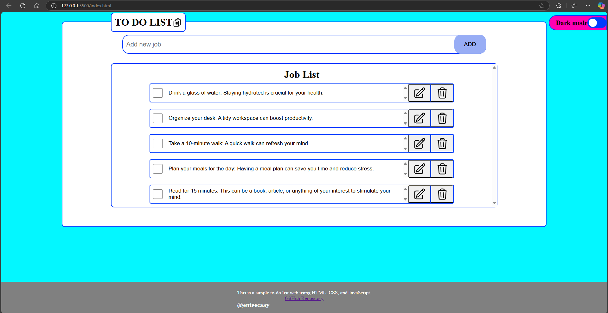
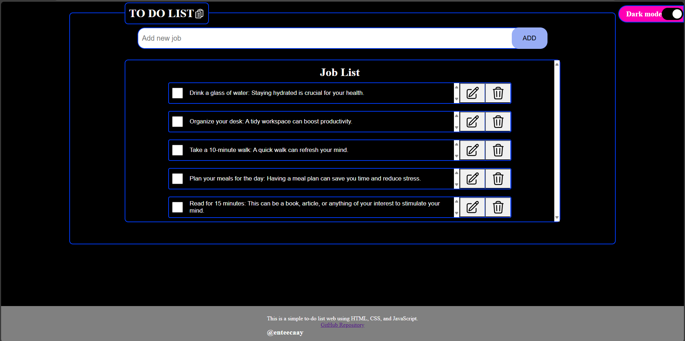

# To-Do List Web Application

This is a simple to-do list web application built using HTML, CSS, and JavaScript.

## Features

- Add new tasks
- Edit existing tasks
- Delete tasks
- Mark tasks as completed
- Drag and drop to reorder tasks
- Dark mode toggle
- Persistent storage using LocalStorage

## Getting Started

### Prerequisites

You need a web browser to run this application.

### Installation

1. Clone the repository:
   ```sh
   git clone https://github.com/enteecaay/Todolist-HTML-CSS-JS.git
   ```
2. Open the `index.html` file in your web browser.

## Usage

1. To add a new task, type the task in the input field and click the "ADD" button or press "Enter".
2. To edit a task, click the edit button next to the task.
3. To delete a task, click the delete button next to the task.
4. To mark a task as completed, check the checkbox next to the task.
5. To reorder tasks, drag and drop them in the desired order.
6. To toggle dark mode, use the switch in the header.

## Screenshots

#### Web running

)

#### Web running in darkmode


